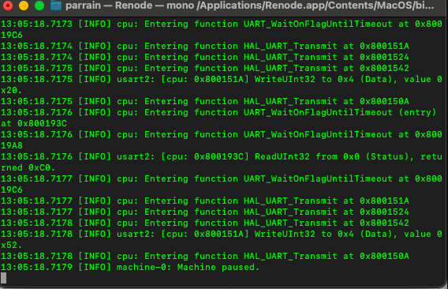
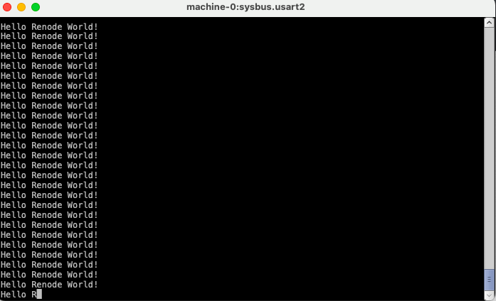

# Renode Simulation Exploration
This repository contains the project utilized for use in Renode simulation of the stm32f103 device. It prints out a hello world message via the USART2 line. This USART is commonly used in STM dev boards for the Virtual Com port. 

---

## Results of Simulation
---

Logging Results after starting the simulation

---

Machine 0 sysbus.usart2 Analyzer display

---

## Steps to Reproduce Output

### Required dependencies
- [Renode](https://www.github.com/renode/renode)
- [STM32CubeIDE](https://www.st.com/en/development-tools/stm32cubeide.html)

1. Once dependencies are installed and available. Clone this repository.
2. Open the project in the STM32CubeIDE.
3. Build the project to generate the elf file.
4. Open a terminal program
5. Type renode in the terminal and press enter
6. Once Renode is open, enter the following:
    
    1. `mach create`
    
    2. `machine LoadPlatformDescription @platforms/cpus/stm32f103.repl`

    3. `sysbus.cpu LogFunctionNames true`

    4. `sysbus LogAllPeripheralAccess true`

    5. `sysbus LoadELF @/path/to/elf/file`

    6. `showAnalyzer sysbus.usart2`

    7. `start`

7. Once simulation is started, you will see "Hello Renode World!" in the sybus.usart2 analyzer window.

8. There should also be logging of the Function Names and the Peripheral Access in the terminal window

9. type quit to exit renode

